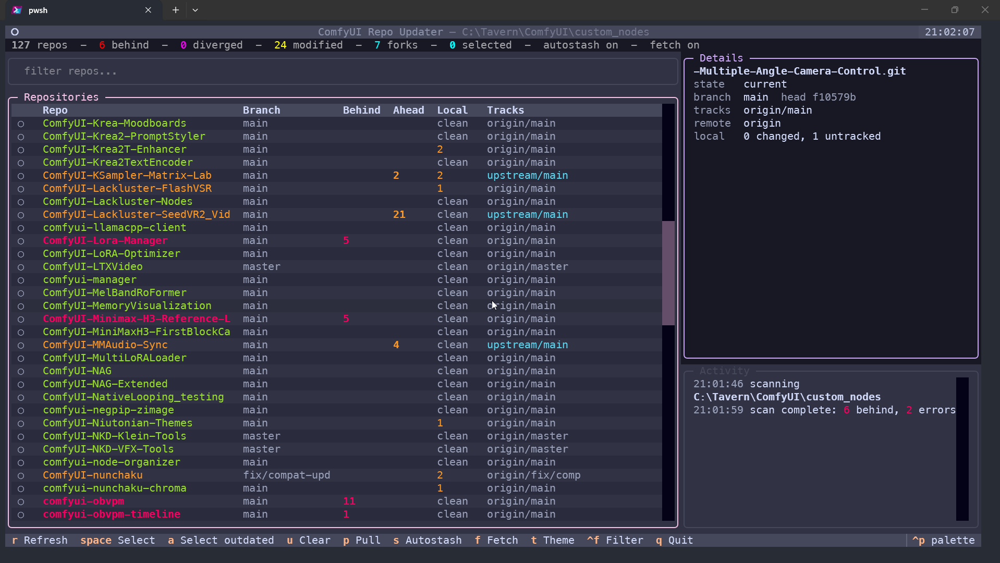

# ComfyUI-Custom-Node-Updater-TUI



A terminal UI for keeping every git-based ComfyUI custom node up to date, safely.

Point it at your `custom_nodes` folder and it scans every repository inside, fetches
upstream in parallel, and shows you exactly which checkouts are behind. Updates are
**fast-forward only**: it never creates a merge commit, never rebases, and never
touches a repo that has diverged or would lose work.

```
 127 repos  -  6 behind  -  0 diverged  -  3 modified  -  2 forks  -  4 selected  -  autostash on  -  fetch on
```

---

## Table of contents

- [Why this exists](#why-this-exists)
- [Features](#features)
- [Requirements](#requirements)
- [Installation](#installation)
- [Quick start](#quick-start)
- [How the custom_nodes folder is found](#how-the-custom_nodes-folder-is-found)
- [Choosing a folder in the app](#choosing-a-folder-in-the-app)
- [The interface](#the-interface)
- [Repository states](#repository-states)
- [Keyboard shortcuts](#keyboard-shortcuts)
- [How a pull works](#how-a-pull-works)
- [Autostash and overlap protection](#autostash-and-overlap-protection)
- [Forks and upstream remotes](#forks-and-upstream-remotes)
- [Settings reference](#settings-reference)
  - [Command-line flags](#command-line-flags)
  - [Environment variables](#environment-variables)
  - [Config file](#config-file)
- [Launcher scripts](#launcher-scripts)
  - [Windows (batch and PowerShell)](#windows-batch-and-powershell)
  - [macOS and Linux (shell)](#macos-and-linux-shell)
- [Troubleshooting](#troubleshooting)
- [Limitations](#limitations)
- [Development and self-test](#development-and-self-test)
- [License](#license)

---

## Why this exists

A mature ComfyUI install has anywhere from a few dozen to a couple hundred custom
nodes, and almost all of them are independent git repositories. Keeping them current
by hand means visiting each folder and running `git pull`, and doing that blindly is
how people lose local tweaks, end up mid-merge, or clobber a checkout they were
experimenting in.

This tool does the boring part (discovering repos and checking upstream) and refuses
to do the dangerous part (anything that could overwrite your work).

## Features

- **Parallel fetching** - remotes are fetched concurrently (up to 8 at a time) so a
  full scan stays fast even with a large `custom_nodes` folder.
- **Tracks the right upstream** - compares against the branch that actually tracks
  upstream, and understands forks that have a separate `upstream` remote.
- **Fast-forward only** - updates are applied with `git merge --ff-only`. There is no
  path in this tool that creates a merge commit or a rebase.
- **Refuses to destroy work** - repos with local commits (diverged), a detached HEAD,
  no upstream, or conflicting local edits are skipped and explained, never forced.
- **Optional autostash** - dirty repos can be stashed, updated, and restored
  automatically. If local edits overlap incoming changes, the repo is skipped instead
  of half-applied.
- **Folder picker with memory** - if the folder cannot be found automatically, an
  in-app browser asks for it once and remembers the answer.
- **Multi-select and a detail pane** - select individual repos or every outdated one,
  and preview the incoming commits before pulling.
- **No credential prompts** - git is invoked with interactive prompts disabled, so a
  scan never hangs waiting for a password.
- **Keyboard-driven with themes** - six built-in color themes, nothing requires a mouse.

## Requirements

- **Python 3.10 or newer.** The code uses `X | None` type syntax and `from __future__
  import annotations`; 3.13 is what it is developed and tested against.
- **git** available on your `PATH`.
- The **`textual`** and **`rich`** Python packages.
- Windows, macOS, or Linux. Launchers are included for all three: a batch file and a
  PowerShell script for Windows, and a POSIX shell script for macOS/Linux.

## Installation

Clone the repository somewhere convenient (it does not have to live inside ComfyUI):

```sh
git clone https://github.com/LacklusterOpsec/ComfyUI-Custom-Node-Updater-TUI.git
cd ComfyUI-Custom-Node-Updater-TUI
pip install textual rich
```

If your ComfyUI uses a venv, install the dependencies into that same interpreter, or
point a launcher at it (see [Launcher scripts](#launcher-scripts)).

There is no packaging step and no entry point to install - it is a single script.

## Quick start

**Windows:** double-click `ComfyUI-Custom-Node-Updater-TUI.bat`, or run it from a terminal. It finds a
ComfyUI venv automatically, falls back to `python` on your `PATH`, and pauses so you
can read any error. `ComfyUI-Custom-Node-Updater-TUI.ps1` does the same from PowerShell.

**macOS/Linux:** run `./ComfyUI-Custom-Node-Updater-TUI.sh` (after `chmod +x`), or invoke
the script directly as shown below.

**Any platform, manually:**

```sh
python -X utf8 ComfyUI-Custom-Node-Updater-TUI.py
```

The `-X utf8` flag is recommended on Windows so paths and commit messages with
non-ASCII characters render correctly.

Useful first runs:

```sh
# Scan a specific folder once, without saving it
python -X utf8 ComfyUI-Custom-Node-Updater-TUI.py --nodes-dir "C:\Tavern\ComfyUI\custom_nodes"

# Look at what is behind without hitting the network
python -X utf8 ComfyUI-Custom-Node-Updater-TUI.py --no-fetch

# Never stash local edits; just report dirty repos and skip them
python -X utf8 ComfyUI-Custom-Node-Updater-TUI.py --no-autostash
```

A scan starts automatically. When it finishes, press `a` to select everything that is
behind, review the confirmation dialog, and confirm to pull.

## How the custom_nodes folder is found

On startup the app resolves the folder to scan in this order, using the first one that
exists:

1. The `--nodes-dir` command-line argument.
2. The `COMFYUI_CUSTOM_NODES` environment variable.
3. The folder you picked last time, from the config file.
4. The `COMFYUI_DIR` environment variable (a `custom_nodes` subfolder is appended if
   the path you give is a ComfyUI install rather than the folder itself).
5. A `custom_nodes` directory found by walking **up** from the current working
   directory.
6. A `custom_nodes` directory found by walking **up** from the script's own location.

If none of those match, the folder picker opens automatically on the first screen.

This means the common case - the script sitting in `ComfyUI/repos/...` or being run
from inside a ComfyUI tree - just works with no configuration.

## Choosing a folder in the app

Press `o` at any time to open the folder picker (it is also shown automatically when no
folder could be found). The picker gives you two ways to choose:

- Browse the directory tree with the arrow keys and press Enter to select a folder.
- Type or paste a path into the field above the tree.

Highlighting a folder fills in the path field, so you can see exactly what will be
used. Selecting a folder and pressing **Use folder** (or entering a path and pressing
it) opens that folder and saves it as your remembered choice. **Cancel** or `Esc`
closes the picker without changing anything.

The chosen folder is written to the [config file](#config-file) so the next launch
goes straight to it.

## The interface

The screen is laid out in four regions:

- **Summary bar (top)** - live counts: total repos, how many are behind, diverged,
  modified, and forks, how many you have selected, and the current autostash and fetch
  toggle states.
- **Progress bar** - appears only while a scan or a pull is running.
- **Repository table (left)** - one row per repo. Columns:

| Column     | Meaning                                                                 |
|------------|-------------------------------------------------------------------------|
| (marker)   | Selection marker: filled circle means selected, hollow circle means not. |
| **Repo**   | Folder name of the repository.                                          |
| **Branch** | Current branch, or `(detached)`.                                        |
| **Behind** | Commits upstream has that you do not.                                   |
| **Ahead**  | Commits you have that upstream does not.                                |
| **Local**  | Count of modified plus untracked files, or `clean`.                     |
| **Tracks** | The ref being compared against, e.g. `origin/main`, or `upstream/main` for a fork. |

- **Detail pane (right top)** - full status for the highlighted repo: branch and short
  HEAD, tracking ref (with a fork marker), remotes, local change counts, then the
  incoming commits and your own commits, and a list of changed files. Up to 15 commits
  per side are shown.
- **Activity log (right bottom)** - timestamped record of scans, pulls, skips, and
  errors. Keeps the last 400 lines.
- **Footer** - the most important keyboard shortcuts.

Filter the table by typing in the filter box (press `Ctrl+F` to focus it); matching is a
case-insensitive substring on the repo name.

## Repository states

Each row is styled by the repo's derived state:

| State      | Meaning                                                          |
|------------|------------------------------------------------------------------|
| `pending`  | Not scanned yet.                                                 |
| `error`    | A git command failed, timed out, or the repo has no remotes.     |
| `behind`   | Upstream has new commits and you have none of your own.          |
| `diverged` | Both you and upstream have commits; a fast-forward is impossible.|
| `ahead`    | You have commits upstream does not, but you are not behind.      |
| `modified` | Clean relative to upstream, but the working tree has changes.    |
| `current`  | Up to date and clean.                                            |
| `pulled`   | Updated during this session.                                     |

States are colored consistently: red for behind, magenta for diverged, yellow for
ahead/modified, green for current, cyan for pulled.

## Keyboard shortcuts

| Key      | Action                                                        |
|----------|---------------------------------------------------------------|
| `r`      | Rescan (re-fetch and re-compare).                             |
| `space`  | Toggle selection of the highlighted repo.                     |
| `a`      | Select every repo that is behind.                             |
| `u`      | Clear the selection.                                          |
| `p`      | Pull the selected repos (opens a confirmation dialog).        |
| `s`      | Toggle autostash on/off.                                      |
| `f`      | Toggle fetch on/off (affects the next scan; press `r` to apply). |
| `o`      | Open the folder picker.                                       |
| `t`      | Cycle through the color themes.                               |
| `Ctrl+F` | Focus the filter box.                                         |
| `Esc`    | Leave the filter box and focus the repo table.                |
| `q`      | Quit.                                                         |

Inside the confirmation and folder-picker dialogs, `Esc` cancels (and `q` cancels the
confirmation dialog).

## How a pull works

Selecting rows and pressing `p` opens a confirmation dialog that lists every selected
repo and what will happen to it - either `pull` or `skip` with the reason. Nothing is
changed until you confirm.

A repo is pulled only if **all** of these are true:

- It was scanned without error.
- Its HEAD is attached to a branch (not detached).
- It has a resolvable upstream/tracking ref.
- It is behind that ref (`behind > 0`).
- It has no local commits of its own (`ahead == 0`).
- Its working tree is clean, **or** autostash is enabled and the local edits do not
  overlap the incoming changes.

Otherwise it is reported with a reason and left exactly as it was. Reasons you may see:

| Reason                          | Meaning                                                    |
|---------------------------------|------------------------------------------------------------|
| `error`                         | The scan hit a git failure for this repo.                  |
| `not scanned`                   | The scan has not finished for this repo.                   |
| `detached HEAD`                 | HEAD is not on a branch.                                   |
| `no upstream`                   | No tracking ref could be resolved.                         |
| `up to date`                    | Nothing to pull.                                           |
| `local commits (diverged)`      | You have commits upstream does not.                        |
| `local changes`                 | Dirty tree and autostash is off.                           |
| `edits overlap incoming changes`| Stashing would conflict, so it is skipped.                 |

When a pull succeeds the repo is re-inspected and re-counted, so the row and detail
pane update immediately and the repo is marked as pulled.

## Autostash and overlap protection

Autostash is **on by default**. When a repo is behind and has local edits, the tool:

1. Stashes tracked and untracked changes (`git stash push --include-untracked`).
2. Fast-forwards.
3. Pops the stash back.

If the pop would conflict - because your edits touch the same files the incoming
commits change - the repo is **skipped entirely** rather than left half-applied. Before
touching anything, the tool compares the paths you changed against the paths in the
incoming commit range; if they intersect, it reports `edits overlap incoming changes`
and moves on.

In the rare case where a stash was applied, the update succeeded, but the pop still
failed, the update is kept, the working tree is reset to the updated commit, and your
edits remain recoverable in the stash. The activity log tells you to run
`git stash pop` to get them back.

Press `s` to disable autostash if you would rather have dirty repos skipped outright
(`local changes`).

## Forks and upstream remotes

If a repository has a remote literally named `upstream`, it is treated as a fork. The
comparison target becomes `upstream/<branch>` (falling back to `upstream/HEAD`, then
`upstream/main`, then `upstream/master`), so staleness relative to the project the fork
was taken from is what shows up - not staleness relative to your own fork. Fork rows
show their target in cyan in the **Tracks** column and are counted separately in the
summary bar.

## Settings reference

### Command-line flags

| Flag             | Default | Description                                                                                     |
|------------------|---------|-------------------------------------------------------------------------------------------------|
| `--nodes-dir`    | auto    | Directory of git repos to scan. Overrides all auto-detection and is not saved to the config.    |
| `--no-fetch`     | off     | Compare against already-fetched local refs only; skips the network entirely.                    |
| `--no-autostash` | off     | Never stash. Repos with local edits are reported and skipped.                                   |
| `--self-test`    | off     | Build throwaway repositories in a temp dir, run a headless scan and pull, print the result, exit.|

### Environment variables

| Variable                   | Description                                                                                   |
|----------------------------|-----------------------------------------------------------------------------------------------|
| `COMFYUI_CUSTOM_NODES`     | Path to the `custom_nodes` folder. Checked before the saved config.                            |
| `COMFYUI_DIR`              | Path to the ComfyUI install; `custom_nodes` is appended. Checked after the saved config.        |
| `COMFYUI_PYTHON`           | Full path to the Python interpreter the launchers should use.                                 |
| `APPDATA` / `XDG_CONFIG_HOME` | Base directory for the config file (set by the OS; read only).                              |

### Config file

The app stores the folder you chose so it can reuse it:

- **Windows:** `%APPDATA%\ComfyUI-Custom-Node-Updater-TUI\config.json`
- **macOS/Linux:** `$XDG_CONFIG_HOME/ComfyUI-Custom-Node-Updater-TUI/config.json`, or
  `~/.config/ComfyUI-Custom-Node-Updater-TUI/config.json` when `XDG_CONFIG_HOME` is unset.

Format:

```json
{
  "nodes_dir": "C:\\Tavern\\ComfyUI\\custom_nodes"
}
```

If the saved folder no longer exists, it is ignored and detection continues. Deleting
the file simply forgets your choice. Autostash and fetch are runtime toggles and are
**not** persisted - they reset to their defaults (both on) each launch.

## Launcher scripts

Three convenience wrappers find a suitable Python and run the script. None of them
hardcode a venv name or an absolute path. In order they try:

1. `COMFYUI_PYTHON` (`%COMFYUI_PYTHON%` on Windows), if set and the file exists.
2. A virtual environment inside `COMFYUI_DIR` (default: two levels above the script),
   looking for `.venv`, `venv`, `env`, `.venv132`, or `venv132`.
3. The same set of venv names in the script's parent directory, then the script folder.
4. `python` on your `PATH` (`python3`, then `python`, on macOS/Linux).

All three run the script with `-X utf8` and forward any arguments you pass. If your
ComfyUI lives somewhere unusual, set `COMFYUI_DIR` (or `COMFYUI_PYTHON`) before
launching.

### Windows (batch and PowerShell)

- `ComfyUI-Custom-Node-Updater-TUI.bat` - double-click friendly. Looks for
  `Scripts\python.exe`, propagates the exit code, and pauses so the window stays open.
- `ComfyUI-Custom-Node-Updater-TUI.ps1` - the same resolution logic for PowerShell.
  Run it with `.\ComfyUI-Custom-Node-Updater-TUI.ps1` (you may need
  `-ExecutionPolicy Bypass` if script execution is restricted).

### macOS and Linux (shell)

`ComfyUI-Custom-Node-Updater-TUI.sh` is a POSIX `sh` wrapper that looks for
`bin/python` inside the venv candidates. Make it executable once, then run it:

```sh
chmod +x ComfyUI-Custom-Node-Updater-TUI.sh
./ComfyUI-Custom-Node-Updater-TUI.sh
```

You can also run the script directly with any interpreter that has `textual` and
`rich` installed:

```sh
python3 -X utf8 ComfyUI-Custom-Node-Updater-TUI.py
```

For a venv-based ComfyUI, use that venv's `bin/python`. If the folder is not detected
automatically, either pass `--nodes-dir` or press `o` and pick it once.

## Troubleshooting

**"Choose a custom_nodes folder first (press o)"**
Nothing was found automatically and no folder has been chosen yet. Press `o` and pick
your `custom_nodes` directory, or pass `--nodes-dir`.

**The table is empty after choosing a folder**
Only immediate subdirectories that contain a `.git` folder are listed - the scan is not
recursive, and dotfiles/dot-folders are skipped. If your nodes live in nested folders,
point the tool at the folder that directly contains the repo folders.

**A repo shows `error`**
Hover the row - the detail pane and activity log show the underlying message (fetch
failed, timed out, no remotes, and so on). Common causes are no network, a private repo
needing credentials, or a remote that no longer exists. Credential prompts are
deliberately disabled, so a repo that needs interactive auth will fail fast rather than
hang.

**A repo is stuck on `local commits (diverged)`**
You have commits upstream does not. Resolve it yourself (rebase, merge, or reset) - the
tool will not do anything that could discard them.

**"edits overlap incoming changes"**
Your local edits touch the same files an incoming commit changes, so autostash would
conflict. Commit or stash those changes manually, then rescan.

**Fetch seems slow or hangs on one repo**
Each fetch has a 180-second timeout and each regular git call a 60-second timeout.
Slow or unreachable remotes raise the total scan time. Use `--no-fetch` to inspect
local refs without any network traffic.

**Non-ASCII text looks wrong on Windows**
Run with `-X utf8` (the launcher already does).

## Limitations

- Only **immediate** subdirectories of the chosen folder are scanned; nested repos are
  not discovered.
- The tool will not rebase, merge, or force anything. Diverged repos are always left for
  you to handle.
- Autostash and the fetch toggle are per-session and are not saved.
- There is no "update ComfyUI itself" or dependency-install behavior - it only moves git
  checkouts forward.
- A repo with no resolvable upstream is reported but never updated.

## Development and self-test

There is a headless self-test that builds a bare origin plus a few cloned repos in a
temporary directory, exercises a full scan and a real fast-forward pull, and asserts the
safety behavior:

```sh
python -X utf8 ComfyUI-Custom-Node-Updater-TUI.py --self-test
```

Expected output ends with a line like:

```
OK: scanned 4 repos, pulled demo (kept local edits), skipped overlap (edits overlap incoming changes) and diverged (local commits (diverged))
```

The test covers the happy path, autostash with non-overlapping edits, the intentionally
skipped overlap case, and a diverged repo that must be left untouched.

## License

Released under the **GNU General Public License v3.0**. The full text is in the
[`LICENSE`](LICENSE) file.

This program is free software: you can redistribute it and/or modify it under the terms
of the GNU General Public License as published by the Free Software Foundation, either
version 3 of the License, or (at your option) any later version.

This program is distributed in the hope that it will be useful, but WITHOUT ANY
WARRANTY; without even the implied warranty of MERCHANTABILITY or FITNESS FOR A
PARTICULAR PURPOSE. See the GNU General Public License for more details.
